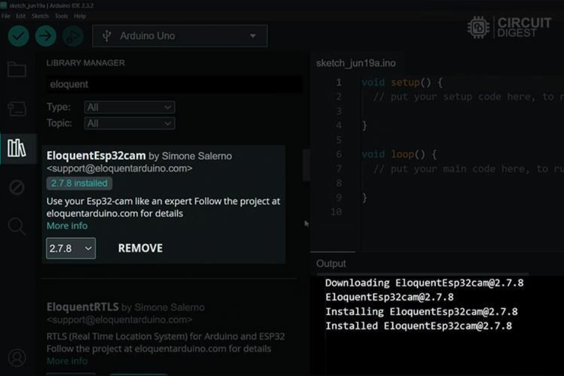

# ESP32-CAM Person Counting with Edge Impulse 

Dự án này triển khai mô hình **FOMO (Faster Objects, More Objects)** được huấn luyện bằng [Edge Impulse](https://edgeimpulse.com) để nhận diện và **đếm số người trong lớp học** bằng **ESP32-CAM**.  
Kết quả hiển thị qua **WebServer** với ảnh từ camera và số người được cập nhật theo thời gian thực.

---

**Bước 1:** Cài đặt thư viện

**Bước 2:** Trong Arduino chọn Examples -> EloquentEsp32cam -> Collect_Images_for_EdgeImpulse

Dùng example trong WebCamServer để collect data. Có thể download chương trình arduino tại đây [link](...)
Tiếp theo, sẽ Thu thập dataset để train trên edge impulse 

---
và truy cập  [Edgeimpulse.com](Edgeimpulse.com) để upload dataset.

**Bước 3:** Thu thập dữ liệu trong Edge Impulse
ta có thể tìm thấy tùy chọn “Data Acquisition”. Khi nhấp vào đó, bạn sẽ được chuyển đến trang cho phép thêm và gán bounding box

**Bước 4: Creating Impulse** 
Chúng ta sẽ tiến hành tạo một impulse theo quy trình của Edge Impulse. Điều này có nghĩa là chúng ta sẽ thực hiện cấu hình cơ bản để Edge Impulse có thể lấy dữ liệu thô đã thêm ở bước trước, sau đó áp dụng xử lý tín hiệu (signal processing) nhằm trích xuất các đặc trưng, và cuối cùng sử dụng khối học máy (learning block) để phân loại dữ liệu mới.

**Bước 5: Generating Features**
Vào object detection chọn learning rate 0.01 model FOMO & MobileNet V2 0.1 (thỏa mãn yêu cầu F1-Score và latency)

**Nhận xét về kết quả huấn luyện mô hình**

Hình trên thể hiện kết quả đánh giá mô hình sau khi huấn luyện với định dạng nén Quantized (int8) nhằm tối ưu bộ nhớ.

- Chỉ số F1 Score tổng thể đạt 78.9%, cho thấy mô hình có khả năng phân loại ở mức khá.

- Ma trận nhầm lẫn (Confusion Matrix) cho thấy:

- Lớp Background được dự đoán chính xác 100%, không có sai sót.

- Lớp Person có độ chính xác thấp hơn, với 75% dự đoán đúng và 25% bị nhận diện nhầm thành Background. Điều này chứng tỏ mô hình vẫn gặp khó khăn trong việc nhận diện người trong một số trường hợp phức tạp (ánh sáng, góc nhìn, độ phân giải).

Các chỉ số chi tiết (Metrics):

- Precision = 0.83 → Khi mô hình dự đoán là “Person”, có 83% là đúng.

- Recall = 0.75 → Mô hình mới chỉ phát hiện được 75% số “Person” thực sự có mặt.

- F1 Score = 0.79 → Điểm cân bằng giữa Precision và Recall, phản ánh mô hình có độ ổn định trung bình khá.

Hiệu năng trên thiết bị (On-device performance):

- Thời gian suy luận (Inference time) ~ 449 ms, chấp nhận được cho ESP32-CAM.

- Bộ nhớ RAM đỉnh (Peak RAM Usage) ~ 70.9 KB và Flash Usage ~ 68.8 KB, nằm trong giới hạn cho các vi điều khiển nhỏ gọn.
*Có thể tham khảo qua [link_edge_impulse](https://studio.edgeimpulse.com/public/770874/live)*

Sau đó sẽ build model và tải file .zip về

---

**1.** Trên thanh menu, chọn:
Sketch → Include Library → Add .ZIP Library.

**2.** Chọn tập tin .zip đã tải về từ Edge Impulse, ví dụ như của tôi là 
*ei-final-test-arduino-1.0.1.zip* hoặc bạn có thể [tại đâychưa có link](...)

**3.** Arduino IDE sẽ tự động cài đặt thư viện. Sau khi hoàn tất, bạn có thể kiểm tra bằng cách vào lại Sketch → Include Library, tên thư viện sẽ xuất hiện trong danh sách.

**4.** Sau đó mở ví dụ mẫu (Example) từ thư viện vừa cài đặt và chọn esp32_camera để chạy thử nghiệm.

   
  Kết quả huấn luyện mô hình FOMO

*Kết quả chạy thử nghiệm

## 🚀 Tính năng
- Chạy mô hình **Edge Impulse FOMO** trên ESP32-CAM (ESP32-S chip, có PSRAM).
- Cập nhật **số người (person count)** từ inference.
- Web giao diện:
  - Hiển thị ảnh từ camera (`/jpg`).
  - Hiển thị số người đếm được (`/count` JSON).
  - Trang chính `/` tự động hiển thị ảnh và cập nhật số người mỗi giây.
- Tối ưu cho **low-latency**:
  - Dùng **ảnh đơn /jpg** (mỗi lần request một ảnh) → tránh blocking như MJPEG stream.
  - Inference và web server chạy trên **hai core** độc lập.

---

## 📂 Cấu trúc code
- `inferenceTask()`: chạy mô hình Edge Impulse liên tục (core 0).
- `handleRoot()`: render giao diện web HTML + JS.
- `handleJPG()`: trả về một ảnh JPEG.
- `handleGetCount()`: trả về số người ở dạng JSON.
- `ei_camera_capture()`: xử lý ảnh từ camera, resize thành input cho mô hình (96x96).

---

## 🛠 Yêu cầu phần cứng
- ESP32-CAM (khuyên dùng module **AI Thinker**).
- Thẻ nhớ MicroSD (tuỳ chọn).
- USB-UART để nạp code.

---

## 📦 Cài đặt phần mềm

### 1. Arduino IDE
- Arduino IDE 1.8.x hoặc 2.x.
- ESP32 Board Core (>= v2.0.4):  
  Vào `File` → `Preferences` → Thêm vào URL:  

- Chọn board: **ESP32 Wrover Module**  
- Partition Scheme: **Huge APP (3MB No OTA/1MB SPIFFS)**

### 2. Thư viện Arduino
Cài qua **Library Manager**:
- `WiFi`
- `WebServer`
- `esp32-camera`
- Edge Impulse C++ SDK (được export trong thư mục dự án `src/`)

---

