# ESP32-CAM Person Counting with Edge Impulse 

Dự án này triển khai mô hình **FOMO (Faster Objects, More Objects)** được huấn luyện bằng [Edge Impulse](https://edgeimpulse.com) để nhận diện và **đếm số người trong lớp học** bằng **ESP32-CAM**.  
Kết quả hiển thị qua **WebServer** với ảnh từ camera và số người được cập nhật theo thời gian thực.

### Thư viện Arduino ESP32 Ai Thinker CAM cho Nhận diện Người

Đây là một thư viện tương thích Arduino, hỗ trợ **nhận diện người theo thời gian thực** sử dụng **Ai Thinker ESP32 CAM module**.  
Thư viện được tích hợp với **OpenCV** và **YOLO** nhằm mang lại khả năng nhận diện người dựa trên AI một cách hiệu quả, phục vụ cho các ứng dụng **IoT** và **tự động hóa**.

---

#### 🔹 🚀Tính năng
- **Nhận diện người theo thời gian thực** với ESP32 Ai Thinker CAM module.  
- Hỗ trợ các mô hình phát hiện đối tượng **OpenCV** và **YOLO**.  
- Thích hợp cho các tác vụ **tự động hóa** như nhà thông minh, an ninh, giám sát, v.v.  
- Dễ dàng tích hợp với **Arduino IDE** để triển khai nhanh chóng.  

---

#### 🛠 Yêu cầu phần cứng
- ESP32-CAM (khuyên dùng module **AI Thinker**).
- Thẻ nhớ MicroSD (tuỳ chọn).
- USB-UART để nạp code.

---

#### 📦 Yêu cầu phần mềm
- **Arduino IDE**  

- **ESP32 Board Core** (v2.0.4):  
  Vào `File` → `Preferences` → Thêm vào URL: 
```https
https://raw.githubusercontent.com/espressif/arduino-esp32/gh-pages/package_esp32_index.json 
```
- Thư viện **Ai Thinker ESP32 CAM**  

---

#### 🔹 Bắt đầu sử dụng
1. Cài đặt **Arduino IDE** và bổ sung ESP32 Board Package.  
2. Kết nối ESP32-CAM với máy tính thông qua USB to TTL Serial Adapter.  
3. Import thư viện **Ai Thinker ESP32 CAM** vào Arduino IDE.  
4. Tải và chạy các ví dụ mẫu để kiểm chứng khả năng nhận diện người theo thời gian thực.  

---

**Bước 1:** Cài đặt thư viện
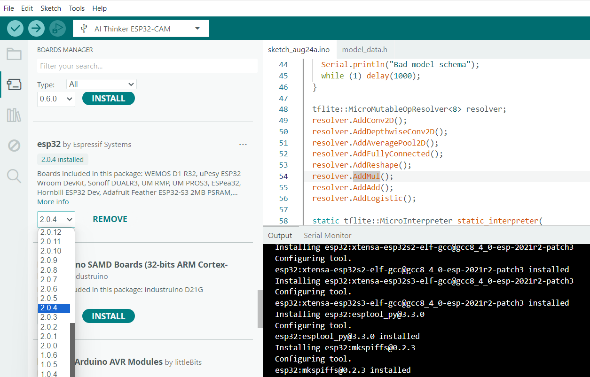

**Bước 2:** Trong Arduino chọn Examples -> EloquentEsp32cam -> Collect_Images_for_EdgeImpulse
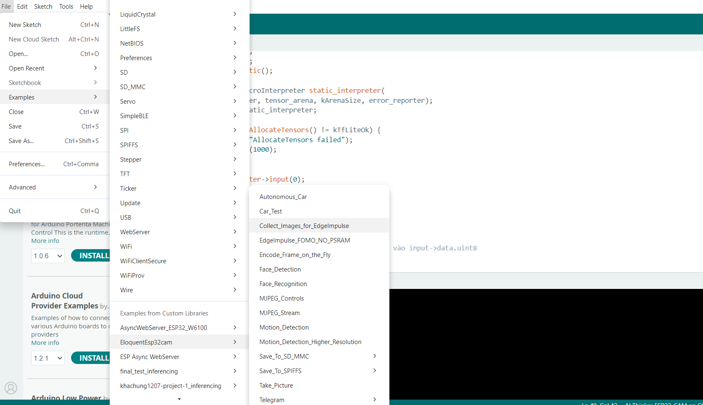

Dùng example trong WebCamServer để collect data. Có thể download [CameraWebServer](./CameraWebServer) để chụp ảnh
Tiếp theo, sẽ Thu thập dataset để train trên edge impulse 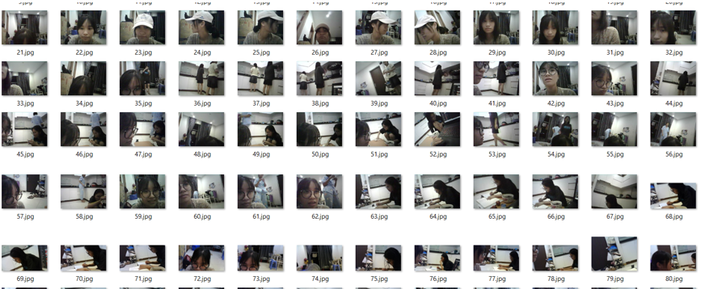

---
và truy cập  [https://docs.edgeimpulse.com/](https://docs.edgeimpulse.com/) để upload dataset.


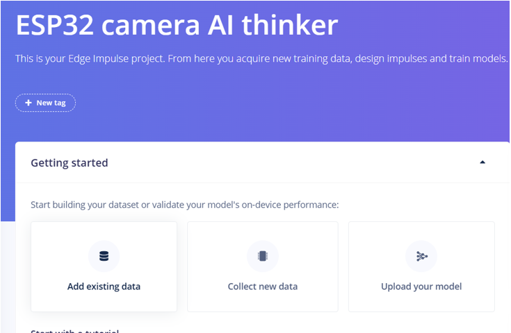


**Bước 3:** Thu thập dữ liệu trong Edge Impulse
ta có thể tìm thấy tùy chọn “Data Acquisition”. Khi nhấp vào đó, bạn sẽ được chuyển đến trang cho phép thêm và gán bounding box
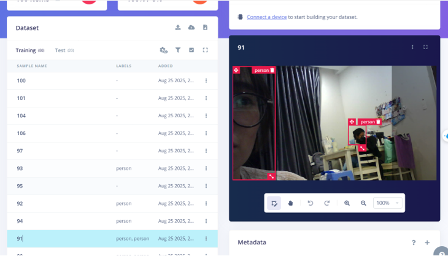

**Bước 4: Creating Impulse** 
Chúng ta sẽ tiến hành tạo một impulse theo quy trình của Edge Impulse. Điều này có nghĩa là sẽ thực hiện cấu hình cơ bản để Edge Impulse có thể lấy dữ liệu thô đã thêm ở bước trước, sau đó áp dụng xử lý tín hiệu (signal processing) nhằm trích xuất các đặc trưng, và cuối cùng sử dụng khối học máy (learning block) để phân loại dữ liệu mới.

**Bước 5: Generating Features**
Vào **Object detection** chọn learning rate 0.01 model FOMO & MobileNetV2 0.1 (thỏa mãn yêu cầu **F1-Score** và **latency**)
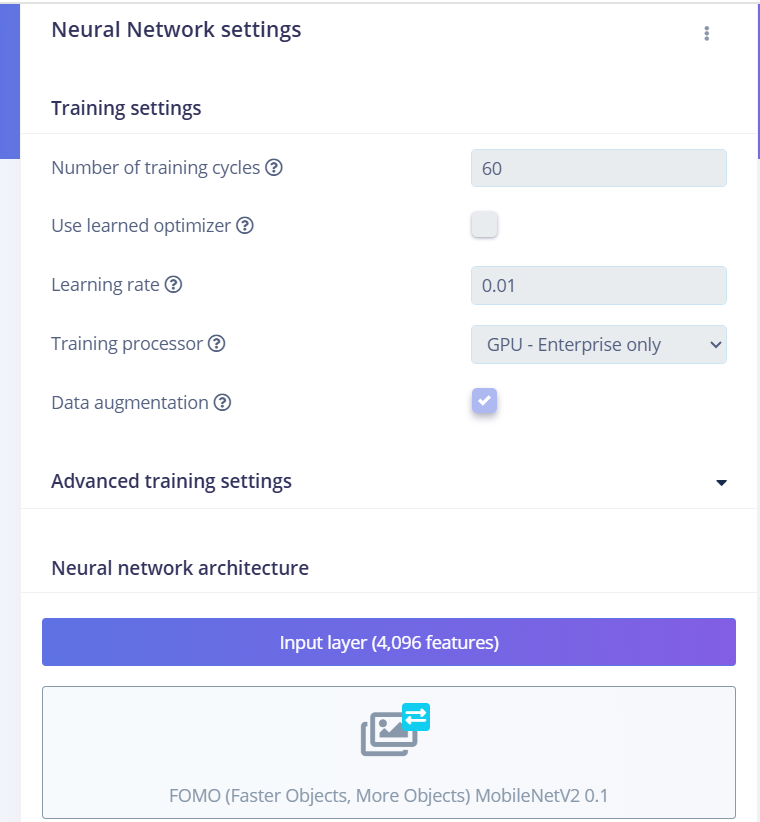

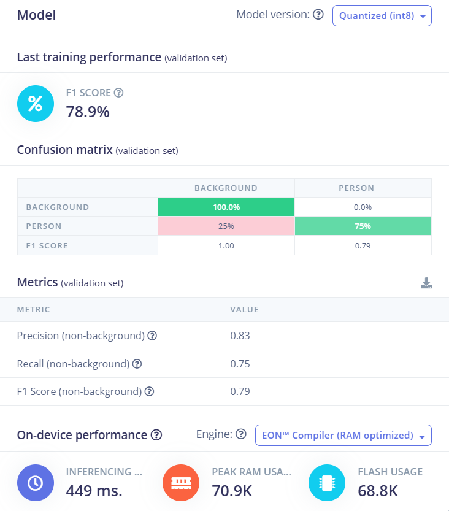

---
**Nhận xét về kết quả huấn luyện mô hình**

Hình trên thể hiện kết quả đánh giá mô hình sau khi huấn luyện với định dạng nén Quantized (int8) nhằm tối ưu bộ nhớ.

- Chỉ số F1 Score tổng thể đạt 78.9%, cho thấy mô hình có khả năng phân loại ở mức khá.

- Ma trận nhầm lẫn (Confusion Matrix) cho thấy:

- Lớp Background được dự đoán chính xác 100%, không có sai sót.

- Lớp Person có độ chính xác thấp hơn, với 75% dự đoán đúng và 25% bị nhận diện nhầm thành Background. Điều này chứng tỏ mô hình vẫn gặp khó khăn trong việc nhận diện người trong một số trường hợp phức tạp (ánh sáng, góc nhìn, độ phân giải).

Các chỉ số chi tiết (Metrics):

- Precision = 0.83 → Khi mô hình dự đoán là “Person”, có 83% là đúng.

- Recall = 0.75 → Mô hình mới chỉ phát hiện được 75% số “Person” thực sự có mặt.

- F1 Score = 0.79 → Điểm cân bằng giữa Precision và Recall, phản ánh mô hình có độ ổn định trung bình khá.

Hiệu năng trên thiết bị (On-device performance):

- Thời gian suy luận (Inference time) ~ 449 ms, chấp nhận được cho ESP32-CAM.

- Bộ nhớ RAM đỉnh (Peak RAM Usage) ~ 70.9 KB và Flash Usage ~ 68.8 KB, nằm trong giới hạn cho các vi điều khiển nhỏ gọn.
*Có thể tham khảo qua [link_edge_impulse](https://studio.edgeimpulse.com/public/770874/live)*

Sau đó sẽ build model và tải file .zip về
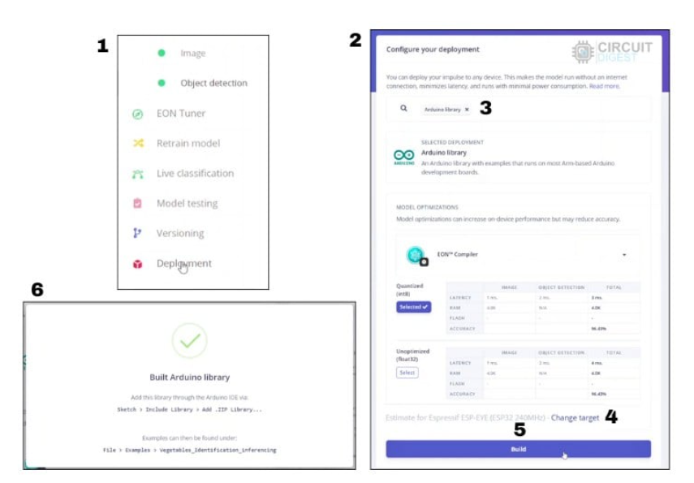

---


**1.** Trên thanh menu, chọn:
Sketch → Include Library → Add .ZIP Library.

**2.** Chọn tập tin .zip đã tải về từ Edge Impulse, ví dụ như của tôi là 
*ei-final-test-arduino-1.0.1.zip*, có thể bạn train lại dataset nhận diện người hoặc bạn có thể tải library [tại đây](./ei-final-test-arduino-1.0.1.zip).

**3.** Arduino IDE sẽ tự động cài đặt thư viện. Sau khi hoàn tất, bạn có thể kiểm tra bằng cách vào lại Sketch → Include Library, tên thư viện sẽ xuất hiện trong danh sách.

**4.** Sau đó mở ví dụ mẫu (Example) từ thư viện vừa cài đặt và chọn esp32_camera để chạy thử nghiệm. Bạn có thể download [code này](./detect_person_model) đẫ được tối ưu chạy và ghi nhận kết quả.


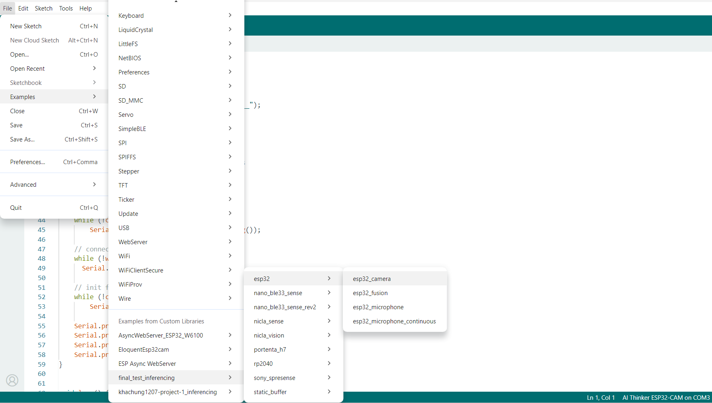
<p align="center">
  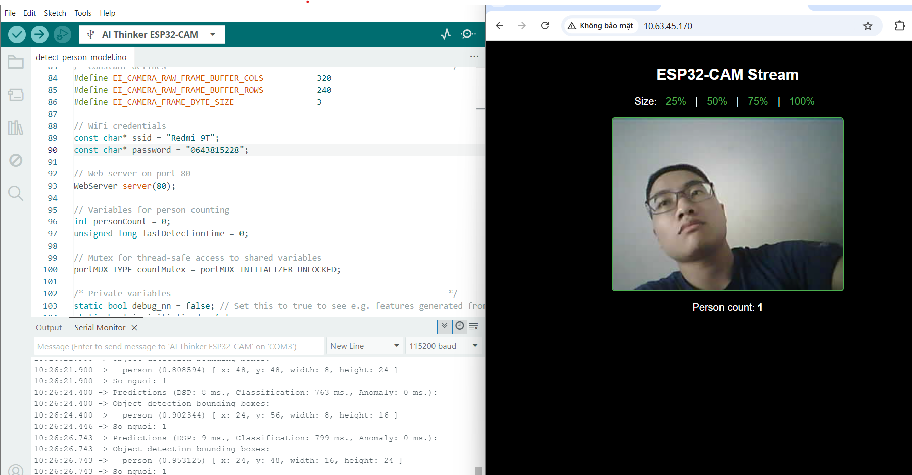<br>
  <span style="text-align: center;">Kết quả huấn luyện mô hình FOMO</span>
</p>

---
***Quá trình huấn luyện mô hình thông qua hai biểu đồ:**
<p align="center">
  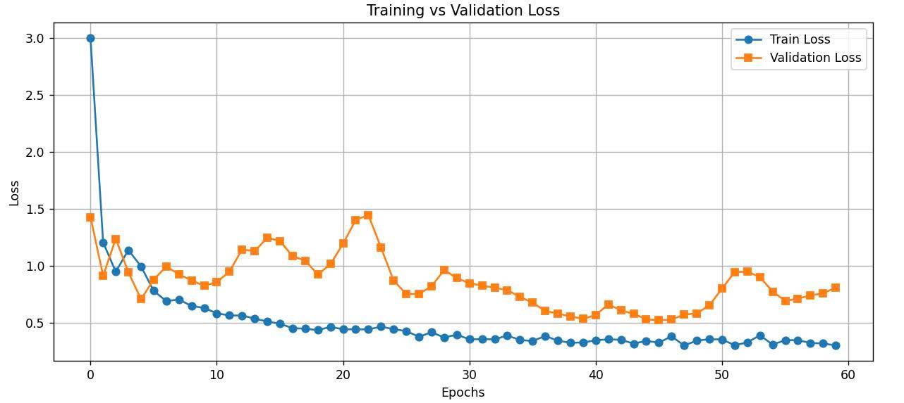<br>
  <span style="text-align: center;">Sự thay đổi giá trị Training Loss và Validation Loss theo số epoch</span>
</p>
<p align="center">
  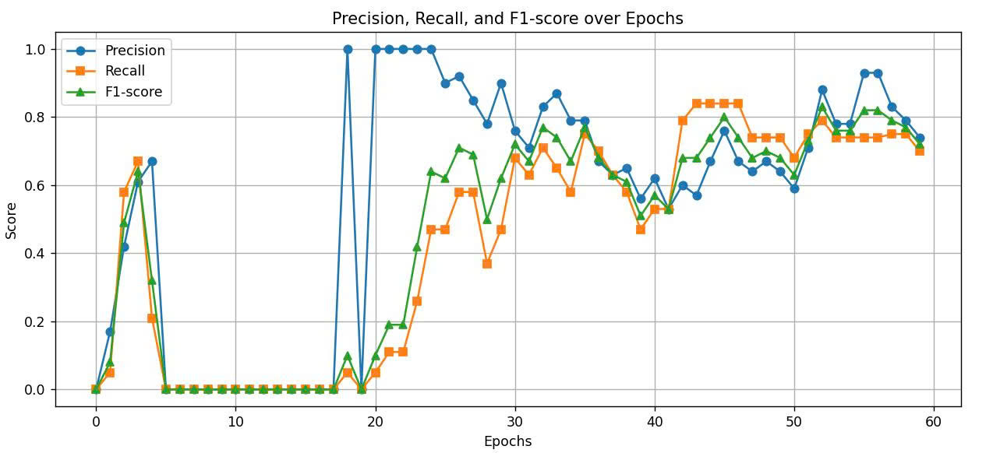<br>
  <span style="text-align: center;">Sự biến thiên của các chỉ số Precision, Recall và F1-score theo thời gian huấn luyện.</span>
</p>

Có thể thấy Training Loss và Validation Loss đều giảm theo thời gian, cho thấy mô hình học tốt từ dữ liệu. Các chỉ số Precision, Recall và F1-score đều đạt mức cao và duy trì ổn định sau khoảng 40 epoch, chứng tỏ mô hình có khả năng phân loại hiệu quả và đáng tin cậy. Nhìn chung, mô hình đã đạt chất lượng tốt và hoàn toàn đáp ứng yêu cầu triển khai thực tế.


---


